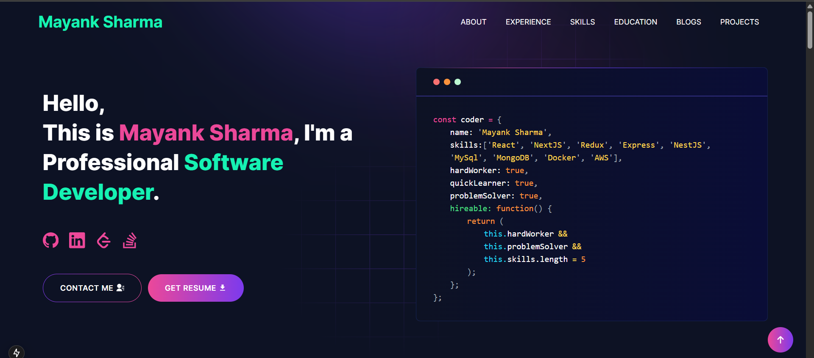

<p align="center" width="100%">
    
</p>

---

# 🚀 [Built with ❤️ by Mayank Sharma](https://github.com/mayank-sharma-dev/portfolio)

<<<<<<< HEAD
# 🔥 Live Demo



=======
---

# Developer Portfolio

#### Want to create a stunning portfolio without reinventing the wheel? This portfolio template is built to be sleek, customizable, and perfect for showcasing your developer journey — from projects to skills and contact details. It's optimized for both developers and freelancers alike.

---

🔗 **View the live site here:** [https://your-deployment-url.vercel.app](https://your-deployment-url.vercel.app)
>>>>>>> 2f1fbe4945c42296ecee1e9d0812d35f519bc195

---

## 📚 Table of Contents

- [Sections](#sections-bookmark)
- [Demo](#demo-movie_camera)
- [Installation](#installation-arrow_down)
- [Getting Started](#getting-started-dart)
- [Usage](#usage-joystick)
- [Deployment](#deployment-rocket)
- [Tutorials](#tutorials-wrench)
- [Packages Used](#packages-used-package)

---

## 📌 Sections

- Hero
- About Me
- Experience
- Skills
- Projects
- Education
- Blog
- Contact

---

## ⚙️ Installation

Make sure you have **Git** and **Node.js** installed:

```bash
node --version
git --version
```

Clone and install dependencies:

```bash
git clone https://github.com/mayank-sharma-dev/portfolio.git
cd portfolio
npm install
```

Start the dev server:

```bash
npm run dev
```

Visit: [http://localhost:3000](http://localhost:3000)

---

## 🐳 Docker Setup

```bash
docker-compose up --build
```

Then open [http://localhost:3000](http://localhost:3000)

---

## 🧰 Usage

1. Create a `.env` file from `.env.example`
2. Edit the files inside `utils/data/` to reflect your personal data.

Example:

```js
export const personalData = {
  name: "Mayank Sharma",
  profile: "/profile.png",
  designation: "Full-Stack Developer",
  description: "I'm a passionate developer building modern solutions with AI, backend systems, and cloud.",
  email: "your.email@example.com",
  phone: "+91-XXXXXXXXXX",
  address: "India",
  github: "https://github.com/mayank-sharma-dev",
  linkedIn: "https://linkedin.com/in/mayank-sharma",
  twitter: "https://twitter.com/yourhandle",
  devUsername: "yourDevToUsername",
  resume: "/resume.pdf",
};
```

---

## 🚀 Deployment

### 🔧 Vercel

1. Push your repo to GitHub
2. Go to [https://vercel.com](https://vercel.com) and import your project
3. Add `.env` values
4. Click **Deploy**

Vercel will rebuild whenever you push.

---

## 🛠️ Tutorials

### Gmail App Password

- Enable 2FA → Generate App Password → Add it as `GMAIL_PASSKEY` in `.env`

### Telegram Bot Setup

- Use [@BotFather](https://t.me/botfather) → Get Token → Add it in `.env`

---

## 📦 Packages Used

| Package               | Purpose                                |
|----------------------|----------------------------------------|
| next                 | Framework                              |
| react                | Frontend rendering                     |
| tailwindcss          | Styling                                |
| nodemailer           | Email sending                          |
| lottie-react         | Animations                             |
| react-icons          | Icons                                  |
| axios                | HTTP requests                          |
| sharp                | Image optimization                     |
| react-toastify       | Toast notifications                    |
| @emailjs/browser     | Contact form integration               |

---

## ❓ FAQ

### Getting `"next" not recognized`?

Run this:

```bash
npm install -g next
```

Then try:

```bash
npm run dev
```

---

## 🧠 Pro Tips

- Make your favicon custom! Convert any `.jpeg` image using [favicon.io](https://favicon.io).
- Replace `favicon.ico` in `/public` with the generated one.
- Deploy to Netlify? Same flow as Vercel, just point to the repo and set `.env`.

---

> 💬 If you like it, give it a ⭐ and connect with me on [LinkedIn](https://linkedin.com/in/mayank-sharma)
